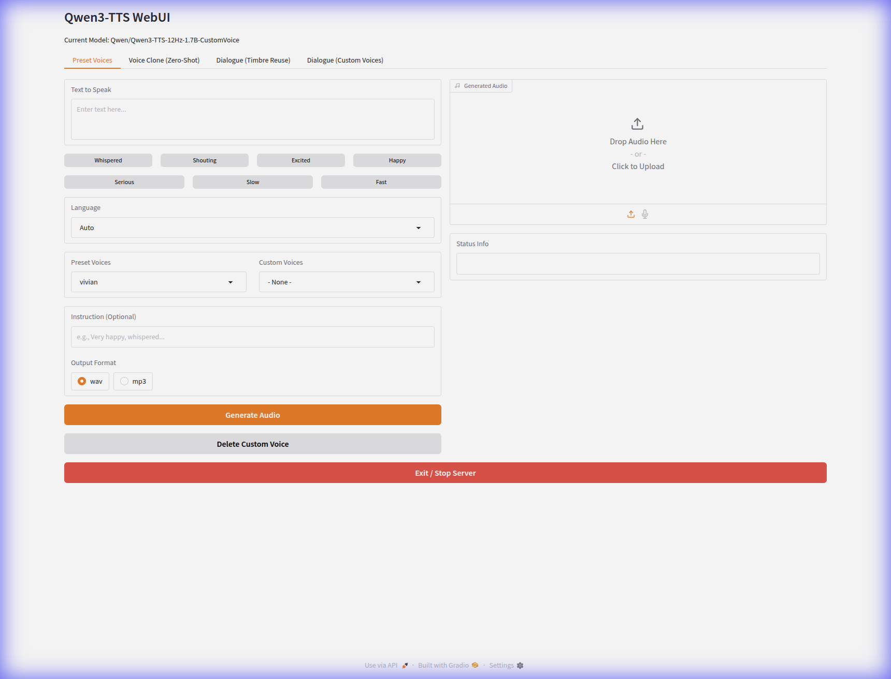
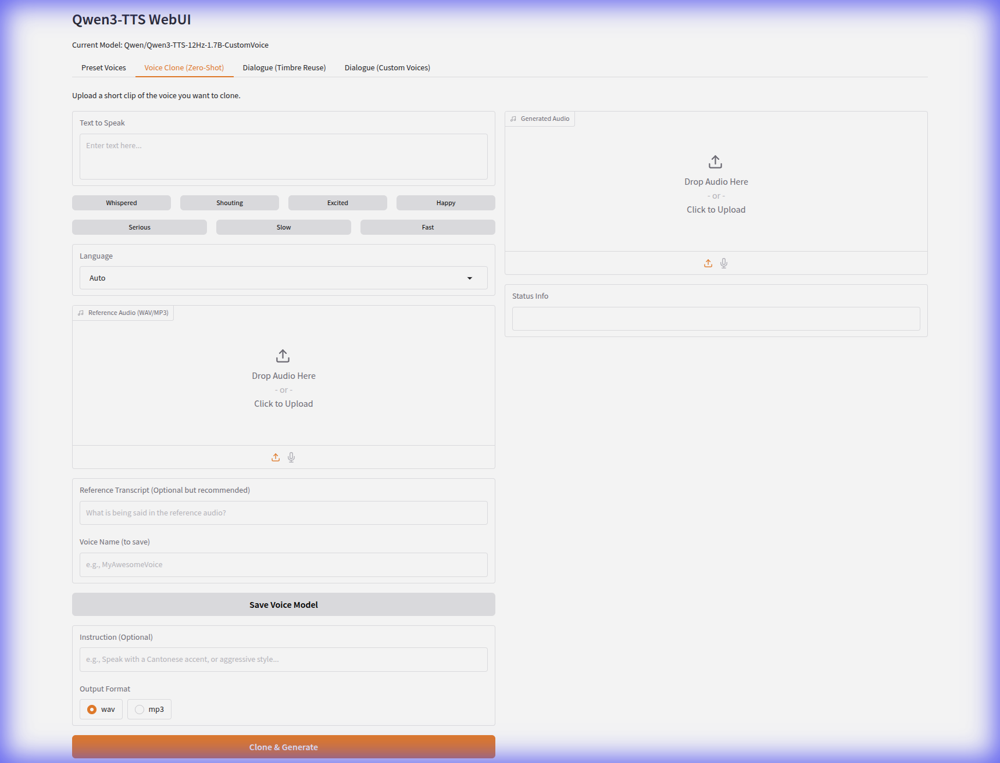

# Qwen3-TTS WebUI

A powerful and user-friendly WebUI for Qwen3-TTS, supporting high-quality speech generation through preset voices and zero-shot voice cloning.

## Features

- **Preset Voices**: Access a wide range of high-quality predefined speakers.
- **Voice Clone (Zero-Shot)**: Upload or record a short audio clip (3-10s) to clone any voice instantly.
- **Voice Management**:
  - Save cloned voices for future use.
  - Saved voices appear automatically in the Preset Voices dropdown.
  - Easily delete custom voices from the UI.
- **Flexible Formats**: Export your generated audio as either `.wav` or `.mp3`.
- **Instruction-aware**: Provide instructions (e.g., "Whispered", "Very happy") to influence the tone and delivery of preset voices.
- **Adaptive Generation**: Intelligent switching between ICL (In-Context Learning) and X-Vector modes for best result quality.

## Installation

1. **Clone the repository**:
   ```bash
   git clone https://github.com/mlabsnz2022/Qwen3-TTS-WebUI.git
   cd Qwen3-TTS-WebUI
   ```

2. **Set up the environment**:
   It is recommended to use a virtual environment:
   ```bash
   python3 -m venv venv
   source venv/bin/activate
   pip install -r requirements.txt
   ```
   *(Note: Ensure you have `ffmpeg` installed on your system for MP3 conversion support.)*

## Usage

### Running the WebUI
The easiest way to start the application is using the provided script:
```bash
./run_tts.sh
```
This script activates the virtual environment, sets memory management optimizations, and launches the Gradio interface.

### Preset Voices



1. Enter the text you want to speak.
2. Select a speaker from the dropdown (includes both built-in and saved custom voices).
3. (Optional) Provide instructions for style or emotion.
4. Choose your output format (`wav` or `mp3`).
5. Click **Generate Audio**.

### Voice Cloning



1. Upload a short reference audio file or use the microphone.
2. Enter the transcript of the reference audio (recommended for better quality).
3. Enter the text you wish to generate.
4. (Optional) Provide a name and click **Save Voice Model** to keep the voice for later.
5. Click **Clone & Generate**.

## Project Structure

- `app.py`: The main Gradio application logic.
- `run_tts.sh`: Startup script.
- `custom_voices/`: Directory where your saved voice models (audio and transcripts) are stored.
- `generate_tts.py`: CLI-based generation utility.

## License

MIT

---
*Developed by MLABS using the DeepMind Advanced Agentic Coding Application.*
