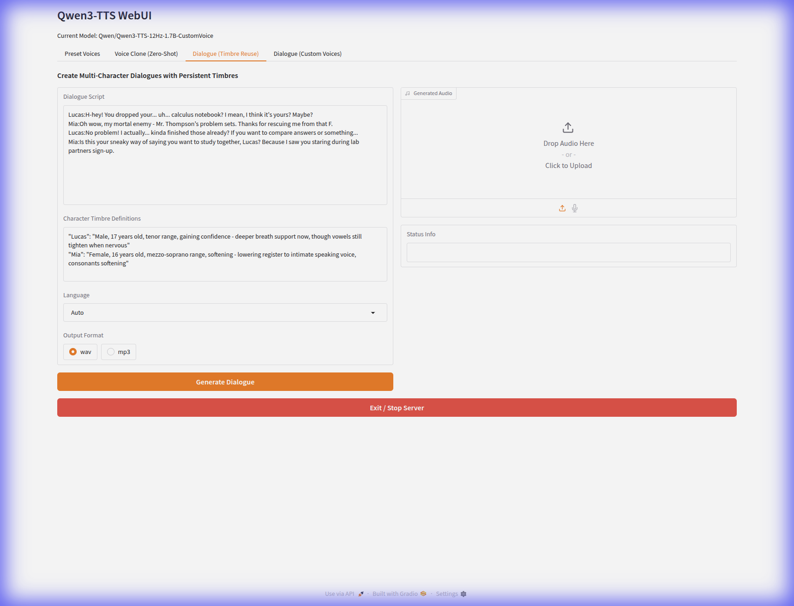
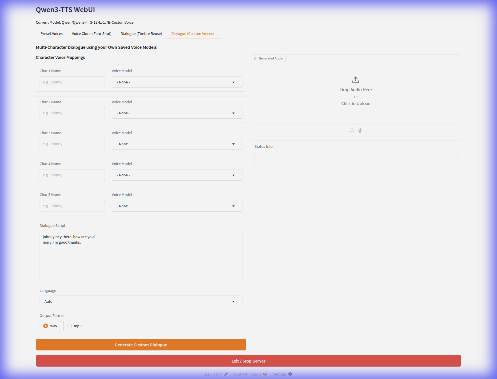

# Qwen3-TTS WebUI

A powerful, user-friendly, and feature-rich WebUI for Qwen3-TTS. This interface supports state-of-the-art speech generation, zero-shot voice cloning, and advanced multi-character dialogue creation with persistent identities.


## Core Capabilities

- **Preset Voices**: Access high-quality predefined speakers with instant generation.
- **Voice Clone (Zero-Shot)**: Clone any voice from a 3-10s audio clip with high fidelity.
- **Style Control**: 
  - **Quick Buttons**: Instantly apply styles like *Whispered*, *Shouting*, *Excited*, or *Serious* using one-click tags.
  - **Natural Language Instructions**: Command the model with prompts like "Speak in a very calm Cantonese accent" or "Sound like a tech enthusiast."
- **Multi-Character Dialogue**:
  - **Timbre Reuse (Voice Design)**: Define new characters using natural language and generate multi-turn scripts where voices stay consistent.
  - **Dialogue (Custom Voices)**: Explicitly map your own saved voice models to character names for reliable, production-ready conversations.
- **Session Management**: 
  - **Compact History**: View and replay all previous generations in a scrollable grid gallery.
  - **Voice Library**: Save, load, and manage your custom cloned voices directly from the UI.
- **Flexible Export**: Seamlessly export generations as `.wav` or `.mp3`.

---

## Installation

### 1. Clone the repository
```bash
git clone https://github.com/mlabsnz2022/Qwen3-TTS-WebUI.git
cd Qwen3-TTS-WebUI
```

### 2. Set up the environment
We recommend using a virtual environment:
```bash
python3 -m venv venv
source venv/bin/activate
pip install -r requirements.txt
```
*(Note: Ensure you have `ffmpeg` installed on your system for MP3 conversion support.)*

---

## Usage

### Starting the Application
Simply run the provided startup script:
```bash
./run_tts.sh
```
This script handles virtual environment activation, memory optimizations, and launches the Gradio server.

### Tab-by-Tab Guide

#### 1. Preset Voices

Select from built-in or your own saved voices. Use style buttons to refine the delivery and get instant results.

#### 2. Voice Cloning

Upload a reference clip, provide a transcript for maximum quality (ICL mode), and optionally save the model to your permanent library.

#### 3. Dialogue (Timbre Reuse)

Perfect for storytelling. Define characters by description (e.g., "Lucas: 17yo male, tenor") and write a script. The model ensures "Lucas" sounds the same every time he speaks.

#### 4. Dialogue (Custom Voices)

Map specific character names in your script to your carefully curated library of saved custom voices for total control over multi-speaker audio.

---

## Technical Details
- **Base Models**: `Qwen3-TTS-12Hz-1.7B` (Base, CustomVoice, and VoiceDesign variants).
- **Generation Modes**: Automatically switches between **ICL (In-Context Learning)** for highest quality with transcripts and **X-Vector** for fast, transcript-free cloning.
- **Audio Processing**: High-fidelity 24kHz output with on-the-fly MP3 conversion.

## License
MIT

---
*Developed by MLABS using the DeepMind Advanced Agentic Coding Application.*
